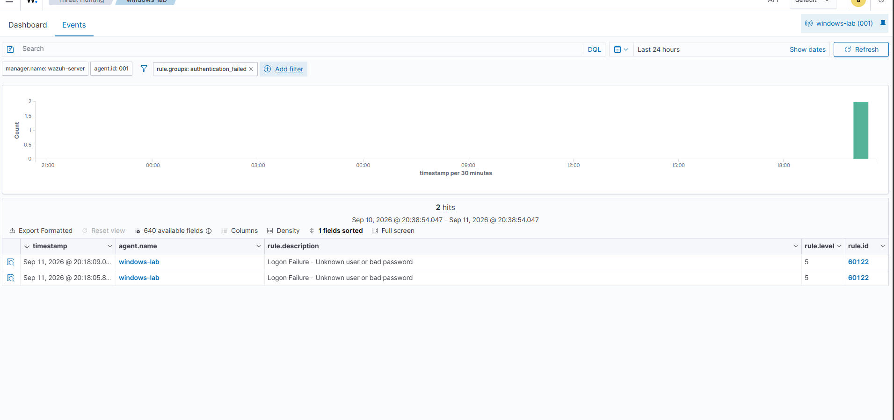
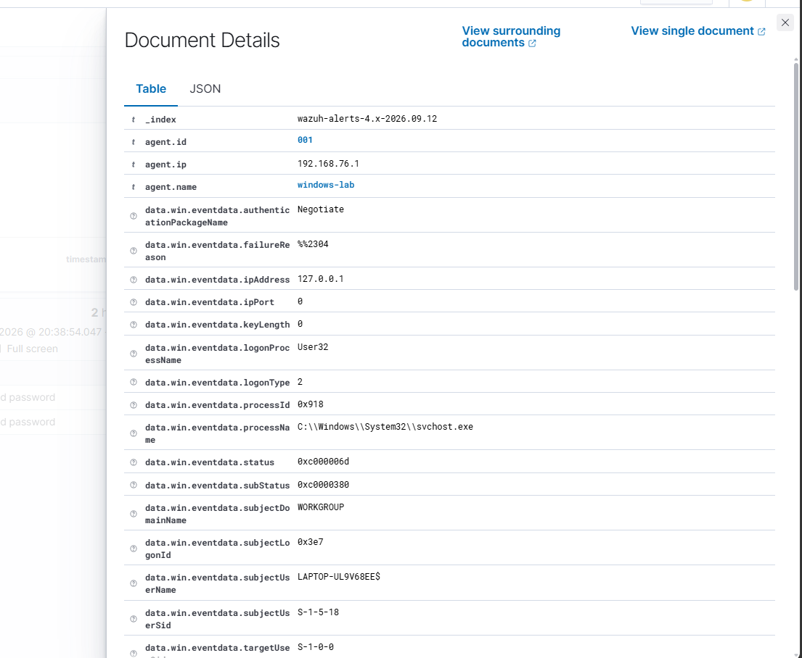

# Scenario 1 — Windows Failed Logon Detection

## Overview

This scenario demonstrates how a Security Operations Center (SOC) analyst can use Wazuh to detect and investigate failed Windows authentication attempts.

Two controlled failed logon attempts were intentionally generated on the Windows 11 endpoint. The resulting security events were collected by the Wazuh agent, analyzed by the Wazuh server, and investigated through the Threat Hunting interface.

> **Lab note:** The failed authentication attempts in this scenario were intentionally generated for testing in a controlled environment.

---

## Objective

The goals of this scenario were to:

- Generate controlled failed Windows logon attempts
- Verify that Wazuh detects the authentication failures
- Filter SIEM telemetry to isolate relevant events
- Examine the underlying Windows Security event
- Understand the difference between a Wazuh alert and the raw event data
- Practice basic SOC investigation methodology

---
## Detection Evidence

The Wazuh Threat Hunting interface was filtered using the `authentication_failed` rule group. The query returned the two controlled failed logon attempts generated during the lab.



*Figure 1 — Wazuh detected two failed authentication attempts on the Windows 11 endpoint. Both events matched rule 60122 with severity level 5.*
## Detection Workflow

```text
Windows 11 Endpoint
        │
        │ Failed authentication attempt
        ▼
Windows Security Log
        │
        │ Event ID 4625
        ▼
Wazuh Agent
        │
        ▼
Wazuh Manager
        │
        │ Rule evaluation
        ▼
Wazuh Rule 60122
        │
        ▼
Threat Hunting / SOC Investigation
```

---

## Event Analysis

After identifying the failed authentication alerts, I opened one of the events in Wazuh Document Details to investigate the underlying Windows telemetry.



*Figure 2 — Wazuh Document Details showing telemetry associated with the failed authentication event.*

### Key Fields Investigated

The event contained several fields useful during a SOC investigation:

| Field | Observed Value | Meaning |
|---|---|---|
| Authentication Package | `Negotiate` | Windows selected an available authentication protocol |
| Source IP | `127.0.0.1` | The attempt originated from the local machine |
| Logon Process | `User32` | Associated with an interactive Windows logon |
| Logon Type | `2` | Interactive/local logon |
| Process | `C:\Windows\System32\svchost.exe` | Windows Service Host process |
| Status | `0xc000006d` | Authentication/logon failure |
| Windows Event ID | `4625` | Windows recorded a failed logon attempt |
| Wazuh Rule | `60122` | Wazuh rule that identified the event as a failed authentication attempt |

## Analyst Assessment

Because these two failed authentication attempts were intentionally generated as part of the lab, the activity was expected and benign.

However, in a real SOC environment, similar events would require additional context. An analyst could investigate the number and frequency of failures, the targeted account, source system or IP address, subsequent successful logons, and whether the activity deviates from normal user behavior.

This exercise demonstrated the difference between simply receiving a SIEM alert and investigating the telemetry behind that alert.
